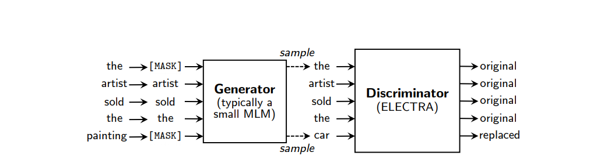

# ElectraModel based on Kolmogorov–Arnold Network

## Introduction

Recently, Kolmogorov–Arnold Networks (KANs) have been introduced as a replacement for Fully Connected Layers.
According to the authors of the paper, KANs have a significant advantage in terms of speed and performance compared to traditional FC layers.

They are currently being actively applied in vision-based models and were recently applied to Transformer decoder models as well.
It has been reported that this has resulted in a substantial improvement in both performance and throuthput side.

Despite the verification of KANs' performance in various areas, I have not yet found examples of their application to the Transformer encoder part.
In this repository, we aim to verify whether KANs can be applied to Transformer encoder models and to evaluate their performance.

## Model Download link

Once the model training is complete, a download link will be provided on Hugging Face.

## About KAN Electra



KAN Electra replaces the fully connected layers in a typical Transformer Encoder model with Kolmogorov–Arnold Networks (KANs). This modification aims to leverage the speed and performance benefits of KANs to enhance the efficiency and effectiveness of the Transformer Encoder.

In the Encoder model, attention is implemented as self-attention using scaled-dot product attention.

Self-attention allows the model to weigh the importance of different words in a sentence relative to each other, regardless of their position. This is particularly useful for capturing long-range dependencies in the input sequence.

Scaled-dot product attention works as follows:
1. **Query, Key, and Value Matrices**: The input embeddings are transformed into three matrices: Query (Q), Key (K), and Value (V).
2. **Dot Product**: The Query matrix is multiplied by the Key matrix to obtain a score matrix. This score indicates the relevance of each word in the sequence to every other word.
3. **Scaling**: The scores are scaled down by the square root of the dimension of the Key matrix to prevent the gradients from becoming too small during backpropagation.
4. **Softmax**: The scaled scores are passed through a softmax function to obtain attention weights. These weights determine the importance of each word in the context of the current word.
5. **Weighted Sum**: The attention weights are used to compute a weighted sum of the Value matrix, producing the final output of the attention mechanism.

This mechanism allows the model to focus on relevant parts of the input sequence, enhancing its ability to understand and generate complex patterns in the data.

### Hyperparameters

### Vocab

I use Google's `google/electra-small-discriminator` for English model, `monologg/koelectra-base-v3-discriminator` for korean model. to train KANElectra model for pretraining.

### Data

## Requirements

```text
python 3.8 or higher
torch >= 2.2.0
torch-tensorRT
hydra
lightning
transformers
```

## CLI

### Train

ElectraKAN uses Hydra from Meta Inc to simplify configuring parameters and Easy-to-plug parameters in CLI. You can train ElectraKAN with your own code by using Hydra's own syntax here ss an example of training Electra Language model using generator and discriminator.

```shell
python scripts/pretraining/train.py
```

### Test(TODO)

```shell
python scripts/pretraining/test.py

```

## TensorRT Convert

```shell
trtexec \
    --onnx=${your_onnx_engine_path} \
    --saveEngine=${engine_save_path} \
    --minShape=1x512,1x512,1x512 \
    --optShape=${opt_batch_size}x512,${opt_batch_size}x512,${opt_batch_size}x512 \
    --maxShape=${max_batch_size}x512,${max_batch_size}x512,${max_batch_size}x512
```
